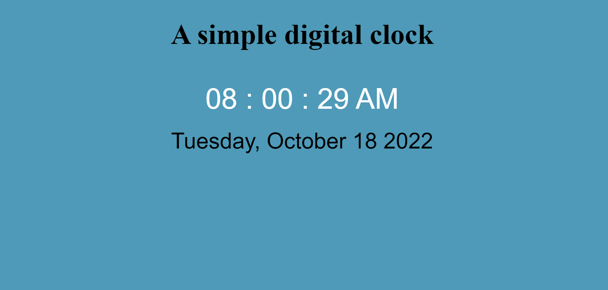

# Digital Clock 

## Digital clock that displays the date using HTML, CSS and JavaScript.  

click [here]( https://saeed7865.github.io/Digital-clock/) to view the digital clock.

### Summary
This is a digital clock i have built as a personal portfolio project. This is the first Project i have built using JavaScript. 
I started with Javascript a couple of weeks ago and have really learned a lot in terms of its functionality and Syntex. In this 
particular project i explored how to use the moment.js library for time.

### Author
- Osama Saeed Sandhu - Full stack developer - [Website]|[Linkedin]
